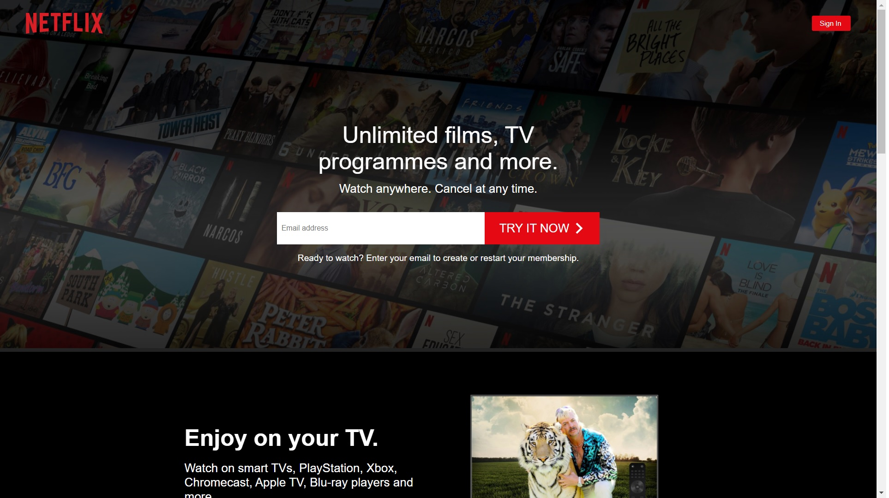

# Netflix Clone APP

---

### Table of Contents

- [Description](#description)
- [How To Use](#how-to-use)
- [Author Info](#author-info)

---

## Description

This application (a Netflix clone) was built using React (Custom Hooks, Context), Firebase & Styled Components. I have built the following pages within this application: sign in, sign up, browse & lastly the homepage. There are four different pages, some using protected routes with auth listeners. Firebase firestore handles all the data and that data is retrieved using a custom hook; authentication is used on all pages, which is handled by Firebase as well.

I used compound components (just a design pattern) to build my components, and there's over 10 examples as to how these are used. The styling is all handled via styled components. Using compound components made my actual dumb components really easy to test.

#### Technologies

- React.js
- Styled Components
- Firebase

[Back To The Top](#netflix-clone-app)

---

## How To Use

### Installation

`npm install`

### Run the project

`npm run start`

[Back To The Top](#netflix-clone-app)

---

## Author Info

- LinkedIn - [Mauricio Brito](https://www.linkedin.com/in/mauricio-brito-62b0a6140/)
- Github - [@mauriciobrito7](https://github.com/mauriciobrito7)

[Back To The Top](#netflix-clone-app)
